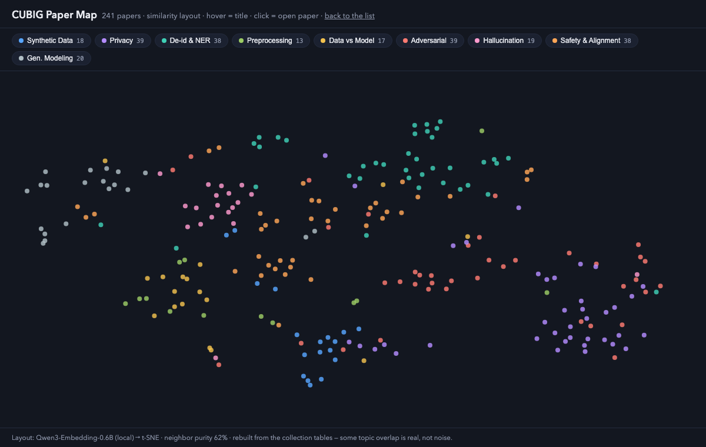

# Awesome Data-Centric & Trustworthy AI 

> Curated papers on **data-centric & trustworthy AI** — synthetic data, privacy, de-identification,
> adversarial robustness, hallucination, data quality, and more.
> 🤖 Auto-curated from an in-house paper-tracking pipeline (arXiv + HF Daily).

**Honest curation note**: papers here are **collected, classified and summarized by our AI-agent pipeline** (arXiv + HF Daily, weekly). Milestones are hand-picked canon; deep vetting happens the honest way — when a paper actually enters our experiments. `Date` = publication (YYYY/MM); venue tag in `Tags` — no venue tag = arXiv preprint.

## 🧭 Explore differently
- [🗺️ Interactive Paper Map](https://cubigcorp.github.io/awesome-data-centric-trustworthy-ai/) — every curated paper as a dot on a similarity map (Qwen3-Embedding, rebuilt weekly)
- [🧭 Questions → Papers](QUESTIONS.md) — start from a problem, not a topic
- [⚖️ Claims Ledger](CLAIMS.md) — what has actually been established
- [🔄 Raw Feed](feed/FEED.md) — this week's untriaged pipeline inflow (full dump: `feed/papers.jsonl`)

## 🌱 Data-Centric
- [🗂️ Synthetic Data](collection/synthetic-data.md) (🏛️8+10)
- [🎨 Generative Modeling](collection/generative-modeling.md) (20) — adjacent: the artifact, not the data
- [🕵️ Privacy](collection/privacy.md) (🏛️8+31)
- [🏷️ De-identification & NER](collection/de-identification-ner.md) (🏛️8+30)
- [🧹 Data Preprocessing & Quality](collection/data-preprocessing.md) (🏛️7+6)
- [⚖️ Data-Centric vs Model-Centric](collection/data-centric-vs-model.md) (🏛️8+9)

## 🛡️ Trustworthy
- [🛡️ Adversarial Robustness](collection/adversarial-robustness.md) (🏛️9+30)
- [💭 Hallucination & Factuality](collection/hallucination-factuality.md) (🏛️8+11)
- [🎯 Safety & Alignment](collection/safety-alignment.md) (🏛️8+30)

## 📎 Meta
- Surveys · Tools · Benchmarks — 🚧 coming soon

## How it works
1. An AI-agent pipeline ingests, classifies and summarizes new papers weekly.
2. Each topic opens with hand-picked **🏛️ Milestones** (the canon), followed by the fresh agent-curated pool.
3. We vet papers when we actually use them — no pretend review theater.

## 🗺️ The map

*Every curated paper as a dot, colored by topic — click through for the interactive version (hover = title, click = paper). Rebuilt automatically with the weekly pipeline.*

> 🏛️ Each collection opens with a **Milestones** table — 64 canonical pre-2026 papers (link-verified) — followed by the weekly agent-curated pool.

## Contributing
See [CONTRIBUTING.md](CONTRIBUTING.md). PRs welcome — format: `| Date | Title | Tags | TL;DR | 요약(KO) |`.

---
Maintained by [CUBIG](https://cubig.ai) · pilot 2026-07-23 · 241 papers (64 milestones + 177 agent-curated)
